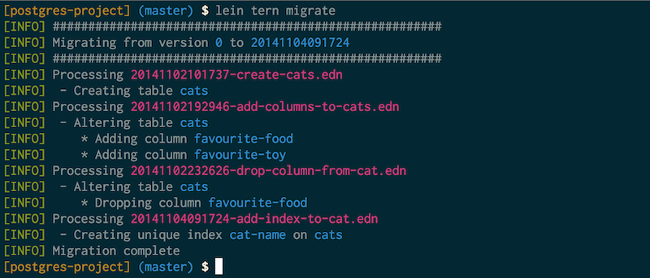
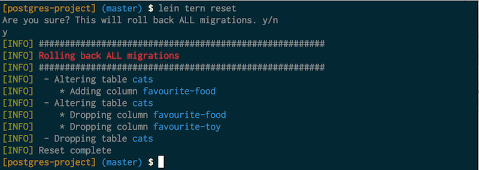

# tern - migrations as data

[](https://travis-ci.org/bugsbio/lein-tern)

The [Artic Tern](http://en.wikipedia.org/wiki/Arctic_tern) holds the
long-distance record for bird migration; therein lies the flimsy justification
for the name of this plugin, which handles database migrations.


<figcaption>
  Arctic tern 8664 <a href="http://creativecommons.org/licenses/by-sa/3.0">CC BY-SA 3.0</a>
  by <a href="http://commons.wikimedia.org/wiki/User:OddurBen">OddurBen</a>
</figcaption>

## Motivation

There are already a number of good migration plugins for Clojure, such as [Drift](https://github.com/macourtney/drift),
which abstract the concept of versioned changes away from any specific datastore.
You can use whatever datastore you like, and whatever library you want to run the individual migrations. Drift has no opinion about it.

This is great - but it is a tradeoff. You get this flexibility in exchange for having to deal
with the specifics of your datastore yourself - in every migration that you write. We didn't want to do have to do this, so we created Tern. Tern lets you specify your migrations as data, like this:

```clojure
{:up [{:create-table :cats
       :columns [:name "VARCHAR(56)" "NOT NULL DEFAULT 'MOGGY'"]}
      {:alter-table :dogs
       :add-columns [[:dislikes "NOT NULL DEFAULT 'cats'"]]}]
 :down [{:drop-table :cats}
        {:alter-table :dogs
         :drop-columns [:dislikes]]}
```

The trade-off here is that if you want to do something in a migration, Tern has to support it. The upside is that the code to support it only needs to be written once, and we've put some effort into making Tern easy to extend with new commands and new datastores. For example, while Tern was originally written with Postgres support only, [@eightbitraptor](https://github.com/eightbitraptor/) was able to add MySQL support over the course of a few hours at the London Clojure Dojo.

## Usage

NB. There are example postgresql and mysql projects in the `examples` directory.

### Installation & Configuration

Add `[lein-tern "0.1.1"]` to the `:plugins` vector of your project.clj, and add a `:tern` key with the following (optional) configuration, shown with default values:

```clojure
(defproject postgres-project "0.1.1"
  :description "Example Postgresql project using Tern"
  :url "http://github.com/bugsbio/lein-tern"
  :license {:name "Eclipse Public License"
            :url "http://www.eclipse.org/legal/epl-v10.html"}
  :plugins [[lein-tern "0.1.1"]]
  :dependencies [[org.clojure/clojure "1.6.0"]
                 [postgresql "9.3-1102.jdbc41"]]

  :profiles {:dev {:source-paths ["dev"]}}

  :tern {:migration-dir "migrations"
         :version-table "schema_versions"
         :color true
         :db {:host        "localhost"
              :port        5432
              :database    "postgres"
              :user        "postgres"
              :password    ""
              :subprotocol "postgresql"}})
```

You almost certainly won't want to have your DB config in your `project.clj` like this - for a start you'll already have configured it elsewhere, and it will be different depending on which environment you're running in. So Tern allows you to specify an extra configuration key `:init`, which should be a namespace-qualified symbol identifying a function on your classpath that returns a config map. This map will be merged into the map specified in your `project.clj`.

Again, see the example projects for details, but here's what it might look like, assuming you keep your config in environment variables, [12 Factor App](http://12factor.net/) style:

```clojure
;; project.clj
(defproject postgres-project "0.1.1"
  ;; ...
  :profiles {:dev {:source-paths ["dev"]}}
  :tern {:init postgres-project.migrations/configure
         :migration-dir "migrations"})
         
;; dev/postgres-project/migrations.clj
(ns postgres-project.migrations)
(defn configure []
  {:db {:classname   "org.postgresql.Driver"
        :subprotocol "postgresql"
        :host        (System/getenv "DB_HOST")
        :database    (System/getenv "DB_DATABASE")
        :user        (System/getenv "DB_USER")
        :password    (System/getenv "DB_PASSWORD")}})
```

You can now see a list of available commands by running `lein help tern`, and confirm that Tern is using the correct configuration values by running `lein tern config`.

You can now either create the database, user, and version table specified in your config yourself, or run `lein tern init` to let Tern create them using the default postgres or mysql user, if no password is set. (This is probably best used only in development.)

### Creating migrations

Create a new migration with `lein tern new-migration [name]`.


This will create a migration file with empty `:up` and `:down` vectors in the migrations directory. Edit the file and add the commands you wish to perform:

```clojure
{:up
 [{:create-table :cats
   :columns [[:id   "BIGSERIAL" "PRIMARY KEY"]
             [:name "TEXT"      "NOT NULL"]
             [:paws "INT"]]}]
 :down
 [{:drop-table :cats}]}
```

Currently Tern supports creating and dropping tables, columns, and indexes, for postgres and mysql, using the following syntax. (The column specs match those supported by [clojure.java.jdbc](https://github.com/clojure/java.jdbc/), which is what Tern uses under the hood):

```clojure
;; Creating a table
{:create-table :cats :columns [[:name "VARCHAR(255)" "NOT NULL DEFAULT 'Kitty'"]]}

;; Dropping a table
{:drop-table :cats}

;; Adding columns
{:alter-table :cats :add-columns [[:favourite-food "TEXT" "DEFAULT 'fish'"]]}

;; Dropping columns
:alter-table :cats :drop-columns [:favourite-food :favourite-toy]}

;; Creating indexes
:create-index :cat-name :on :cats :unique true :columns [:name]}

;; Dropping indexs
{:drop-index :cat-name :on :cats}
```

You can have as many commands as you like in the `:up` and `:down` vectors; they will be executed in order.

### Running migrations

Run all pending migrations with `lein tern migrate` (or just `lein migrate` if you're lazy).



Roll back the last run migration with `lein tern rollback`.


Roll back ALL migrations, ending at the initial state of the database with `lein tern reset`.

 

## Extending Tern

An in-depth guide to extending Tern to work with more datastores is in the works, but for now, take a look at the `Migrator` protocol defined in [src/tern/db.clj](https://github.com/bugsbio/lein-tern/blob/master/src/tern/db.clj). If you create a type that implements this protocol for your datastore, and register it with Tern by calling `(tern.implementations/register :yourdatastoresubprotocol ->YourMigrator)` (where `->YourMigrator` is a constructor function that takes a single argument, the Tern config map), in the configuration function you defined in your `project.clj`, you should be good to go.

## What's next?

Apart from supporting more commands and more datastores, the fact that Tern migrations are just Clojure maps leads to some interesting possibilities for exploration.
What if you slurp your project's entire history of migrations, and merge them? Can they be merged in such a way as to eliminate changes that were later reverted or replaced, leaving you with a single, simple script to create a fresh database for your project in the shape it is now?

## Contributing

Pull requests are welcome! Thank you for wanting to contribute. Here's the process we follow:

1. Fork the project, and clone your fork.
2. Create a feature branch `git co -b my-cool-feature`
3. Hack away, making lots of small commits
4. When you're done, rebase against master `git rebase master -i`. This makes sure you're up to date, so your changes will merge cleanly, and lets you squash your commits into one or two high-level ones. Bonus points if your commit messages start with an :sparkles::heart_eyes:[emoji](http://www.emoji-cheat-sheet.com/):heart_eyes::sparkles: that sums up the emotional content of the commit!
5. Create a pull request into our repo. Actually, it's never too early to do this, so if you want help or advice on your change, just go ahead and create a pull request as a place to discuss it as you work on it.

If you're new to open source, or git, or even Clojure, and you're stuck with any of this, don't worry, just create an issue or a pull-request and we'll happily help you out if we can.

## Acknowledgements

Thanks to [@eightbitraptor](https://github.com/eightbitraptor/) for adding MySQL support.
